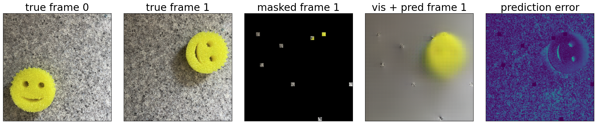
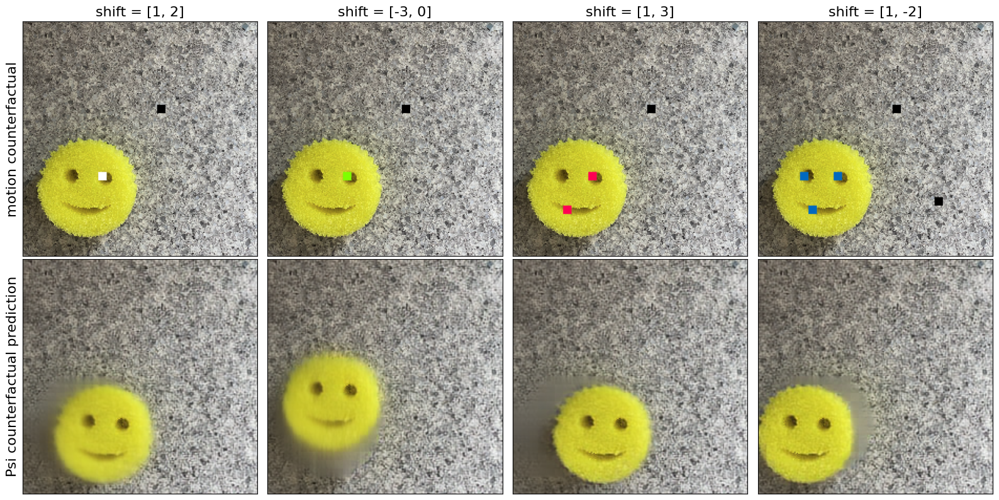
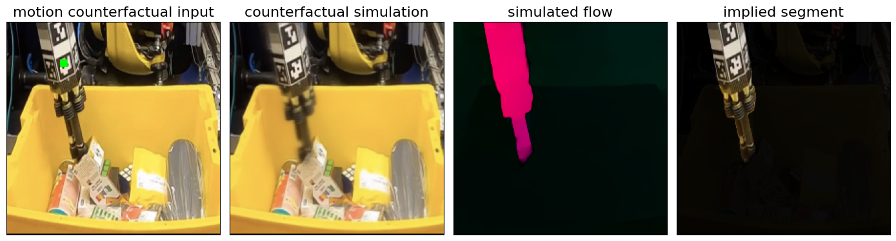
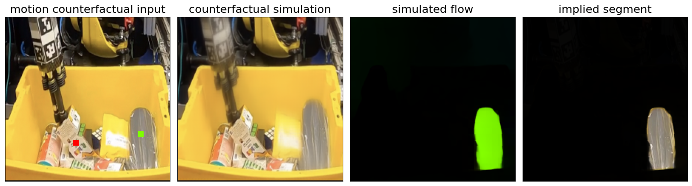
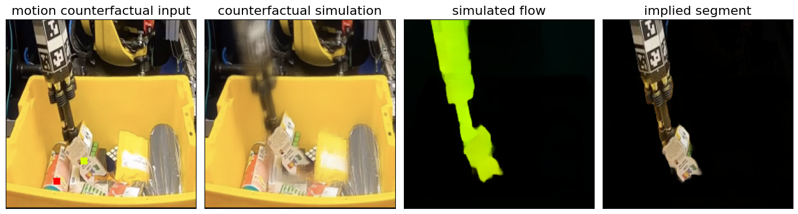
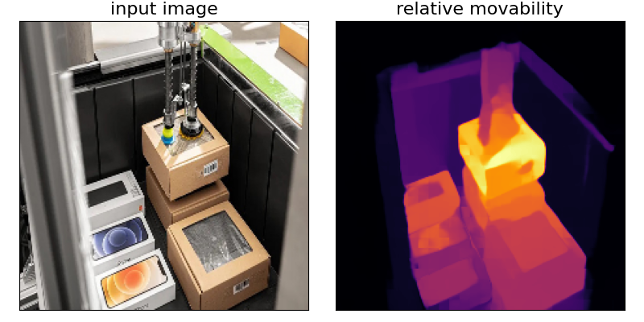
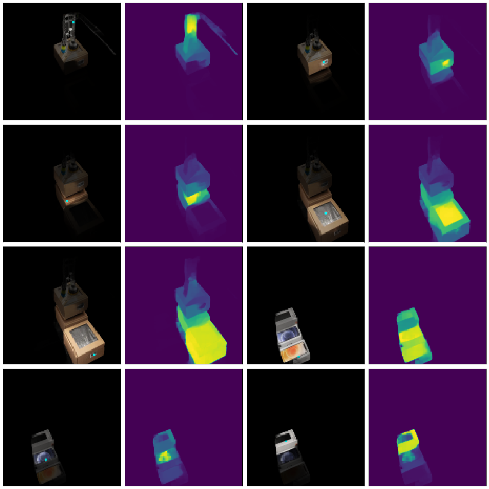

# Counterfactual World Models
An approach to building pure vision foundation models by prompting masked predictors with "counterfactual" visual inputs.

This is the official implementation of [Unifying (Machine) Vision via Counterfactual World Modeling](https://arxiv.org/abs/2306.01828).


## Setup
We recommend installing required packages in a virtual environment, e.g. with venv or conda.

1. clone the repo: `git clone https://github.com/neuroailab/CounterfactualWorldModels.git`
2. install requirements and `cwm` package: `cd CounterfactualWorldModels && pip install -e .`

Note: If you want to run models on a CUDA backend with [Flash Attention](https://github.com/HazyResearch/flash-attention) (recommended), 
it needs to be installed separately via [these instructions](https://github.com/HazyResearch/flash-attention#installation-and-features).

### Pretrained Models
Weights are currently available for two VMAEs trained with the _temporall-factored masking policy_:
- A ViT-base VMAE with 8x8 patches, trained 3200 epochs on Kinetics400
- A ViT-large VMAE with 4x4 patches, trained 100 epochs on Kinetics700 + Moments + (20% of Ego4D)

See demo jupyter notebooks for urls to download these weights and load them into VMAEs.

## Demos of using CWMs to analyze physical properties of scenes

These are a subset of the use cases described in [our paper](https://arxiv.org/abs/2306.01828).

### Run a demo of making factual and counterfactual predictions

Run the jupyter notebook `CounterfactualWorldModels/demo/FactualAndCounterfactual.ipynb`

#### factual predictions


#### counterfactual predictions


### Run a demo of segmenting Spelke objects by applying motion-counterfactuals

Run the jupyter notebook `CounterfactualWorldModels/demo/SpelkeObjectSegmentation.ipynb`

Users can upload their own images on which to run counterfactuals.

#### Example Spelke objects from interactive motion counterfactuals





### Run a demo of estimating the movability of elements of a scene

Run the jupyter notebook `CounterfactualWorldModels/demo/MovabilityAndMotionCovariance.ipynb`

#### Example estimate of movability 


#### Example estimate of counterfactual motion covariance at selected (cyan) points


### Coming Soon!
- [ ] Iterative algorithms for segmenting Spelke objects
- [ ] Using counterfactuals to estimate other scene properties
- [ ] Model training code

## Citation
If you found this work interesting or useful in your own research, please cite the following:
```bibtex
@misc{bear2023unifying,
      title={Unifying (Machine) Vision via Counterfactual World Modeling}, 
      author={Daniel M. Bear and Kevin Feigelis and Honglin Chen and Wanhee Lee and Rahul Venkatesh and Klemen Kotar and Alex Durango and Daniel L. K. Yamins},
      year={2023},
      eprint={2306.01828},
      archivePrefix={arXiv},
      primaryClass={cs.CV}
}
```
